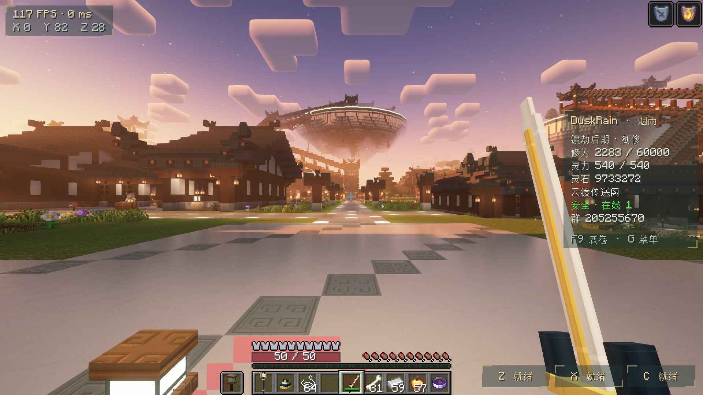
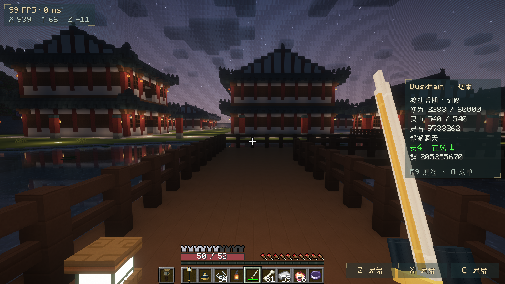

# DuskRain · 烟雨仙途

**青瓦白墙，山水浮岛；由凡入道，御剑登神。**

DuskRain 是基于 **Minecraft Java 1.20.1 / Forge 47.4.10** 制作的中式修仙服务器项目。原创仙城、人物衣装、水墨界面与修炼玩法围绕同一世界设计：从安全主城启程，进入生存世界探索、经营住宅和商铺，结伴挑战试炼，建立宗门洞天。

**当前版本：2.1.0-preview · 协议 7 · Java 17 · 交流群 205255670**

[下载体验版](https://github.com/ETO-ze/duskrain-mc-1.20.1/releases/tag/v2.1.0-preview) · [中文指令手册](docs/中文指令手册.md) · [58页入世指南](docs/入世手册.md) · [验收记录](docs/V14-验收记录.md)

**皮肤站现已开放：[DuskRain 衣冠阁](https://skin.duskrain.cn)**。支持账号注册、皮肤与披风管理，以及游戏服外置登录验证。[百衣藏皮肤与披风库](https://skin.duskrain.cn/library/) 提供 LittleSkin 社区作品搜索、3D 试衣与独立混搭；也可按正版玩家名或 UUID 识别皮肤和当前披风，单独复制或跟随整套外观。[登录说明](docs/账号与外置登录.md) · [皮肤站部署与维护](deploy/skin-station/README.md)



> 图片来自当前游戏实机。项目处于体验版阶段，已完成的自动测试、客户端抽查与尚未完成的验收分别记录；尚未宣称通过20名真人长期联机压测。

## 在烟雨世界里做什么

| 内容 | 当前实现 |
|---|---|
| **山水仙城** | 青瓦白墙、深色木构、石阶廊桥、街市园林与浮空楼阁；具名NPC和柜台提供实际服务 |
| **三条修行流派** | 剑修：剑气、连击与突进；体修：身体强化、震地与护体；术修：火符、寒霜法阵与雷诀 |
| **七境二十一阶** | 炼气、筑基、金丹、元婴、化神、渡劫、登神，每境分初中后期；84件法衣、21件法器 |
| **铭灵附魔** | 八种专属词条，指定升级、费用预览、材料校验；保留原版附魔、铁砧与砂轮机制 |
| **御剑与头衔** | 御剑资格、飞行体验租期、灵力消耗与碰撞校验；名字下方显示境界、等级及宗门身份 |
| **宗门洞天** | 中文宗名、邀请和权限、独立建设区域；当前合欢宗府邸包含歇山顶殿阁与山水庭园 |
| **玩家经营** | 灵石经济、NPC商店、27格商品商铺、部分购买与补货、离线收入、旧寄售迁移 |
| **探索与试炼** | 24项主线、12种每日委托每日分配3项、签到、组队试炼和登神挑战 |
| **住宅与保护** | 相邻区块认领、成员授权、可见领地边界；主城保护与野外PVP规则分开执行 |
| **入世体验** | 新手书、布衣四件套、探索火把、归云罗盘；主城饱食、加速、增强跳跃与二段跳 |

角色进度按 UUID 保存；交易、领奖、伤害、飞行和权限由服务端校验。玩法参数和素材定义保留配置与源文件，便于继续调整。

## 画面与界面

- 宣纸、水墨、青金风格菜单；侧栏、左上信息和技能提示支持轻量显示。
- 原创法衣、法器、NPC模型与贴图，结合立体建筑构件与凹凸材质。
- Embeddium、Oculus、GeckoLib、FerriteCore及动态光源配合使用。
- 提供2060、4060、5070三个参考画质档；名称表示配置目标，实际表现取决于设备。
- 3D Skin Layers通过官方源安装脚本获取，发行包不直接再分发其JAR。

| 合欢宗曲桥与池岸 | 铭灵轩服务人物 |
|---|---|
|  |  |

## 开始体验

### 登录现有服务器

游戏地址：**`nbc.rainplay.cn:42741`**。先在 [衣冠阁注册账号](https://skin.duskrain.cn/web/registration)，再为 PCL2 / HMCL 添加外置认证地址：

```text
https://skin.duskrain.cn/authlib-injector
```

启动器使用皮肤站账号密码登录；服务器验证登录会话后允许进入。原角色使用稳定 UUID 保留进度。旧发行 ZIP 的模组与地图仍适用；外置登录是额外的启动器配置，具体步骤与 PCL2 示例见 [登录说明](docs/账号与外置登录.md)。账户密码不随仓库或发行包提供。

### 下载客户端与服务端包

前往 [Releases](https://github.com/ETO-ze/duskrain-mc-1.20.1/releases)。完整ZIP包含客户端配置、服务端、预生成世界、独立Java17运行时、源码、原创资源及验收文件；同时提供单独模组JAR与SHA-256校验文件。

1. 在正常启动器安装 **Minecraft 1.20.1 + Forge 47.4.10**，使用 **Java 17**。
2. 将包内 `client/mods`、`resourcepacks`、`shaderpacks` 放入对应实例。已有实例先备份，并只保留一个版本的 `duskrain` 模组。
3. 按需应用 `client/config` 和画质预设。服务端与客户端必须同时使用协议7版本。
4. 新开服务端先在解压根目录运行 `setup-server.ps1`，再运行 `server/start-server.bat`；安装脚本下载并校验官方依赖。

完整包包含当前体验世界和原角色数据，仅供仓库授权成员使用。不要直接覆盖其他正在运行的服务器存档。公网监听和资源包地址需要按实际部署修改；详细步骤见 [安装说明](docs/V14-README.md)。

### 常用操作

| 按键或入口 | 用途 |
|---|---|
| `G` / `/dr menu` | 主菜单 |
| `Z / X / C` | 三个主动技能，状态位于右下角 |
| `R`、空格、Shift | 御剑起落、上升、下降 |
| `F9` / `F8` | 卷轴与透明HUD切换 / 左上信息开关 |
| `/dr spawn` / `/dr warp` | 引导回城 / 分区传送 |
| `/dr enchant` | 到铭灵轩办理附魔 |
| `/dr guild` / `/dr claim` | 宗门 / 住宅 |
| `/dr stalls` | 到玩家商铺货柜经营或购买 |
| `/dr guide` | 补领或更新入世指南 |

## 本版修复与验证

- 修复收剑后视角和移动被骑乘状态卡住的问题；连续起落后已实机验证转向与步行。
- 修补铭灵轩悬空地基，调整宗门水岸、曲桥端部与不合法植物落点。
- 原生 **48项必要GameTests通过**；成品服务端在干净安装目录连续启动、保存、重启通过。
- 原有玩家进度、装备、住宅和商铺寄售已比对；58页新指南原位更新。
- 更新包已通过ZIP CRC及全部文件SHA-256校验。

### 性能实测范围

2026-09-16，**Core Ultra 7 265K / 16 GB RAM / RTX 4060**，客户端与集成服务端同机。固定已加载场景中使用20个模拟角色：10个御剑、10个施法，另有一个真实观察客户端。每轮记录1200个服务端tick；客户端预热10秒后采样约30秒，开启垂直同步。

| 设置 | 平均FPS | 帧耗时P95 / 最大 | 服务端tick P95 / 最大 |
|---|---:|---:|---:|
| 720p · 2060参考档 | 104.2 | 14.26 / 35.51 ms | 11.89 / 24.99 ms |
| 1080p · 4060参考档 | 107.4 | 14.22 / 26.54 ms | 14.57 / 94.74 ms |
| 1440p · 5070参考档 | 60.2 | 24.22 / 66.10 ms | 14.54 / 48.19 ms |

三轮都在RTX4060上执行，分辨率和画质同时变化；这些数据不能代替不同显卡对比、20名真人网络容量或长期探索压测。偶发尖峰仍存在。见 [本轮数据摘要](docs/github/validation.json) 与 [详细验收记录](docs/V14-验收记录.md)。

**待完成的验收：**全部衣装/法器/NPC逐套动作与混穿检查，登神三阶段真人完整流程与长期平衡，完整显示组合检查，以及20名真人长时间联机测试。版本继续标为Preview。

## 从源码构建

安装JDK17，在仓库根目录运行：

```powershell
.\mod\gradlew.bat -p .\mod build
.\mod\gradlew.bat -p .\mod runGameTestServer
```

产物为 `mod/build/libs/duskrain-2.1.0-preview.jar`。首次构建需要网络下载Gradle、Forge和声明的依赖。[开发说明](docs/DEVELOPMENT.md) 包含开发客户端、测试目录与本机工具的区别。

```text
mod/src/        自研模组、维度定义、玩法数据、原创模型贴图
mod/gradle/     Gradle Wrapper
assets/         原创资源源文件及第三方版本元数据
tools/          资源生成、打包、安装及本机验收工具
docs/           中文手册、版本规则、素材署名与验收说明
```

Git仓库存放源码、说明与精选实机证据；玩家世界、备份、运行缓存和完整安装包不进入Git历史。完整体验包通过当前私有仓库的Release提供。

## 署名与使用范围

本项目借助GPT6-Astra进行设计、实现与自动验收。截图为真实游戏画面，第三方组件保留各自作者署名和许可。

原创模组按现有 `mod_license=All Rights Reserved` 声明；已有单独许可的资源继续遵循其声明。Forge/MDK、Minecraft、光影及外部模组的许可不由本项目替换。详见 [素材与版本署名](docs/素材与版本署名.md) 和 [3D Skin Layers说明](docs/3D-SKIN-LAYERS.md)。Minecraft游戏本体由正常启动器或官方依赖安装流程获取。

**DuskRain · 烟雨仙途 · 群号205255670**
