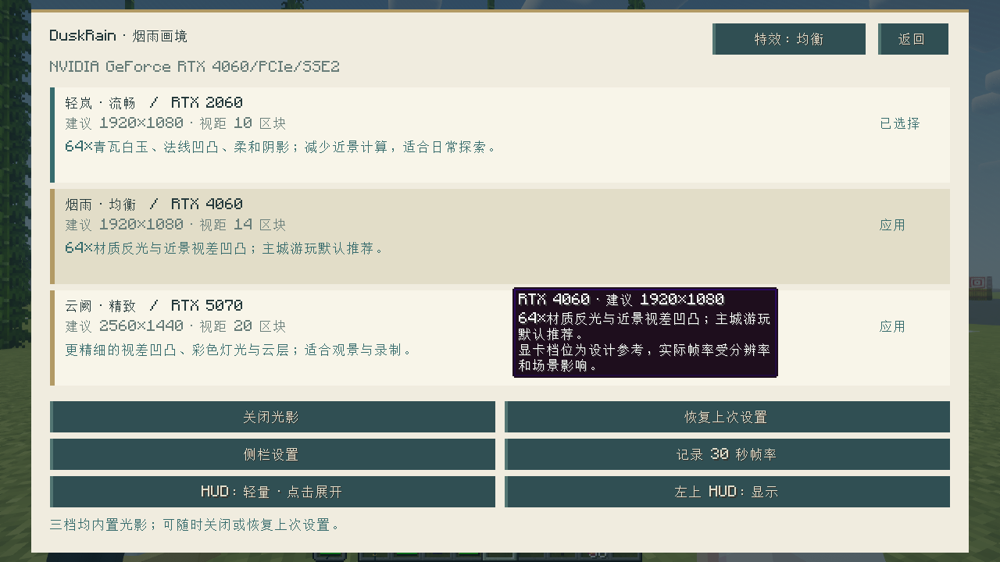

# 2.2.0-preview / Visual r3 发行检查

日期：2026-09-25。只交付客户端；安装参见 [使用说明](../客户端使用说明.md)，变化参见 [更新日志](../../CHANGELOG.md)。

## 交付物

| 文件 | 大小 | 作用 |
|---|---:|---|
| DuskRain-2.2.0-PCL2-Visual-r3.mrpack | 2,950,108 字节 | 推荐：PCL2 导入；官方模组及光影自动下载 |
| DuskRain-2.2.0-client-Visual-r3.zip | 2,960,664 字节 | 备用：已有 Forge 实例，运行官方源安装脚本 |
| SHA256SUMS.txt | 文本 | 两个归档的 SHA-256 |

自研模组 SHA-256：`d4eac2c263e1f06309cb9d1582d03b35196b29a096a08463e8b8c92a43c7cf84`，与已核验公网服相同。此次重新构建成功；比较全部归档条目，只有构建清单里的时间戳变化。发布继续使用此前验证的同一 JAR，客户端交付修正不要求再次更新服务器。

两种包均安装 15 个第三方客户端模组、自研模组和一个光影包。第三方组件下载总计 **16,415,381 字节**，另需启动器安装原版、Forge 及运行依赖。本包不是离线整合包。

## 本次实际验证

- **18 项供应链与成品交付测试通过**：包括依赖约束、错误哈希、光影必选、shaderpacks 路径、两种包参数一致、材质在 JAR 内、生存原版材质不被全局覆盖、CRC 与内容边界。
- 最终 ZIP 在独立空目录完成官方源下载、SHA-512/SHA-256/大小校验；重复运行通过，并保留特意修改的个人配置。
- 从 `.mrpack` 的下载索引安装组件、提取最终 overrides，使用 Java 17 和原生 Minecraft 客户端进入独立世界副本。未改动玩家正式实例或线上世界。
- **RTX 4060、1280×720**：轻岚、烟雨、云阙三档均返回 `inUse=true`、`fallback=false`、`error=Optional.empty`；最终默认配置重新启动也通过，GUI 尺寸为 2。原生截图如下。
- 运行日志仍有第三方兼容性和 shader 编译警告；本次没有出现光影回退或启动崩溃。检查证明可加载，不等同于长期稳定性或性能达标。
- 这是同一张 RTX 4060 上的三档加载检查，不是 RTX 2060/4060/5070 三张卡的性能比较；不使用本轮短采样作多人承载结论。

结构化结果与归档哈希：[validation.json](2.2.0-preview-validation.json)。原始日志和世界副本保留在本机 `docs/qa`、`mod/run-release-visual-r3`，不含在公开客户端包中。

## 之前同构建的证据与边界

- 2026-09-25 00:32：**65 项必要 Forge GameTests 通过**；独立服务端两次启动、保存与退出通过。
- PCL2 2.13.1.1 已完成此前 r2 包的原生导入、Java 17 选择和公网登录，J/F8/G 已检查。Visual r3 新增光影项本轮采用索引解包安装加原生客户端验证，**没有重新操作 PCL2 的导入向导**。
- 公网服已完成 v3 增量迁移；**263,411 次变更、25,743 个保留冲突计数**。还需逐项核查旧建筑冲突，不能声称全城修缮通过。
- 本次没有更新玩家现用的 PCL 实例，没有重新部署或重启公网服。未完成本版 20 人压测和全部历史计划的完整矩阵验收。

Release 的安装包只包含客户端、自研资源、默认配置、说明和官方源下载清单；没有世界、服务端、Java、账号、密码、令牌或原始玩家数据。
