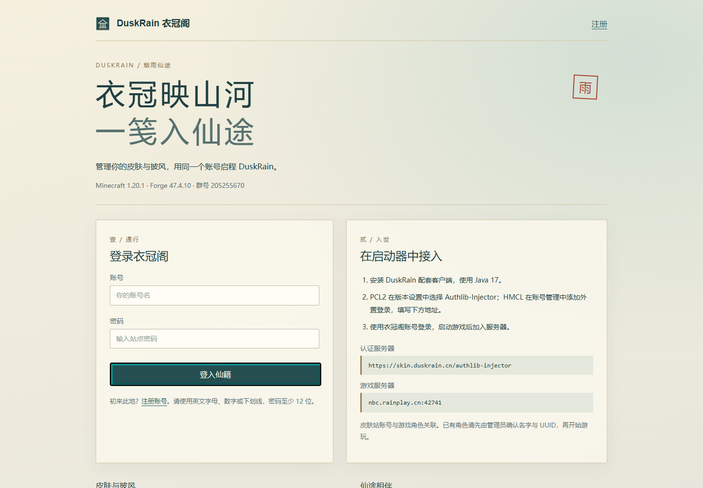
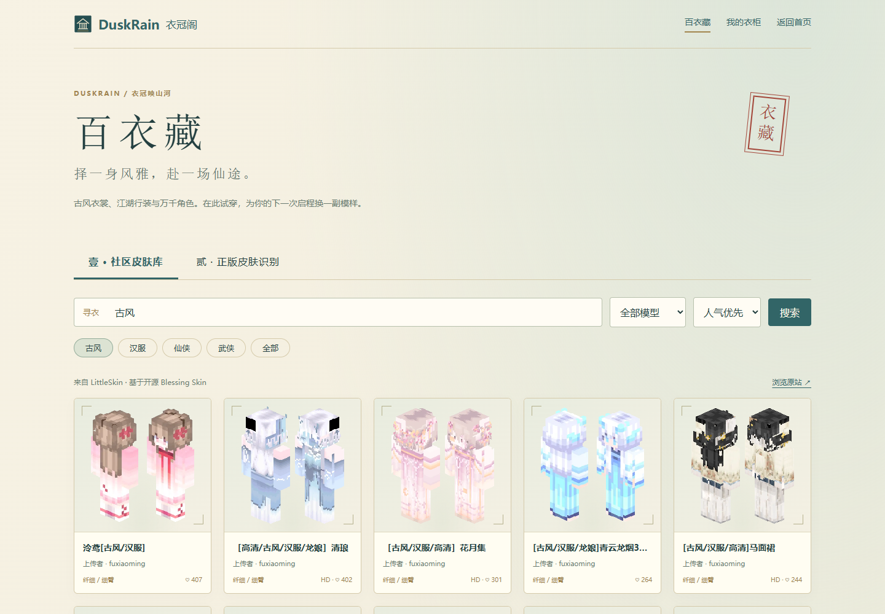
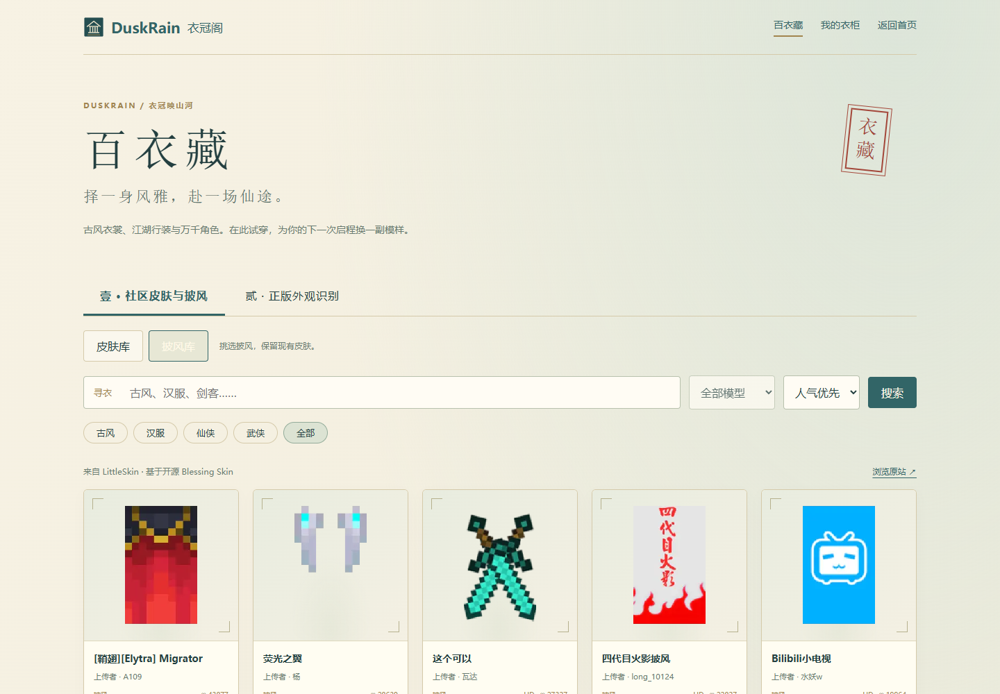

# DuskRain 账号、皮肤与游戏登录



## 第一次进入

1. 打开 [DuskRain 衣冠阁](https://skin.duskrain.cn)，选择注册。
2. 创建账号和密码。账号使用英文字母、数字或下划线，密码至少 12 位；账号对应游戏内角色名称。
3. 用 Minecraft 1.20.1、Forge 47.4.10、Java 17 安装 DuskRain 客户端文件。
4. 将启动器的外置认证地址设为 `https://skin.duskrain.cn/authlib-injector`，填写刚注册的账号密码。
5. 启动后连接 `nbc.rainplay.cn:42741`。群号：205255670。

皮肤站账号同时用于网页和游戏认证，密码不能用游戏服 SFTP 或服务器面板密码代替。

## PCL2

在 DuskRain 的版本设置中选择 **Authlib-Injector 外置登录**：

| 项目 | 填写值 |
|---|---|
| 认证服务器 | `https://skin.duskrain.cn/authlib-injector` |
| 显示名称 | `DuskRain 衣冠阁` |
| 注册地址 | `https://skin.duskrain.cn/web/registration` |
| 自动进入服务器 | `nbc.rainplay.cn:42741` |

预配置的本地版本名为 `DuskRain-1.20.1`。如果新增文件夹后没有出现，在版本选择页刷新一次。PCL2 的配置示例见 [Setup.ini](../deploy/pcl2/Setup.ini)；仅用于新的独立 DuskRain 版本，不要覆盖其他整合包的设置。

选择该版本后，启动器首页会显示相应外置登录入口。输入账号和密码，再点击启动。账号与密码需要个人填写；仓库不会预置任何人的登录令牌。

## HMCL

在账户管理中添加认证服务器，填写上述认证地址，再使用皮肤站账号登录。选择已安装 DuskRain 的 Forge 1.20.1 实例启动。

## 百衣藏：皮肤、披风与正版外观识别

打开 [百衣藏皮肤库](https://skin.duskrain.cn/library/)，或点击衣冠阁顶部的“皮肤库”。





1. 在“社区皮肤与披风”选择 **皮肤库／披风库**，支持搜索、排序和分页；皮肤额外支持宽臂／细臂筛选。
2. 点击作品打开 3D 试衣，拖动旋转、滚轮缩放。披风从背面开始展示，每款保留上传者与 LittleSkin 原站链接。
3. 登录后选择自己的角色，点击“应用此皮肤”或“应用此披风”。只替换所选项，保留另一项外观、角色名、UUID 与游戏进度。若另一项来自正版跟随，会将其当前材质保存到本地，之后可独立混搭。
4. “正版外观识别”输入 **Java 正版玩家名或 UUID**，同时识别皮肤与当前披风。下拉框可选“只换皮肤”“只换披风”“皮肤与披风一起应用”。公开档案未提供披风时，明确显示提示并禁用披风相关选项。
5. 如需自动更新，勾选 **“跟随整套外观（皮肤与披风）”**，确认按钮会变为“跟随整套外观”。这会清除角色当前上传的皮肤与披风两项，改为跟随该正版角色；约 10 分钟缓存，游戏也有缓存，更新后可重新进入服务器。

公开正版档案只能识别该角色**当前穿戴**的披风，不能读取其全部收藏。本站复制的是外观，不会为微软／正版账号新增披风权益，也不验证该账号所有权。自己的 DuskRain 登录账号保持不变。

角色页面仍可手动设置跟随目标；本地上传优先。重新使用自动跟随可在皮肤库选择“跟随整套外观”。仅有披风而没有皮肤的角色也能在衣柜预览披风。

社区来源使用开源 Blessing Skin 平台的 LittleSkin 公共接口；**平台开源不代表皮肤作品均为开源**。作品使用依原作者说明，受保护或未开放下载的作品须在原站处理。来源临时不可用时可稍后重试，或上传自己拥有的皮肤。

## 上传皮肤和披风

网页登录后进入角色管理，上传 PNG 文件并保存。皮肤选择“经典”或“纤细”模型，披风使用符合 Minecraft 尺寸比例的 PNG。皮肤渲染通过同一套认证服务同步；更新后可重进服务器查看。

账号改密在网站的账户设置中完成。忘记密码请联系站点管理员处理，勿把密码发送到交流群。

## 高清皮肤显示

标准皮肤通常是 64×64（旧格式 64×32）；百衣藏标为 HD 的作品可能是 128×128 或更大。网站能保存并预览高清原图，但 Minecraft 1.20.1 原版纹理加载器会拒绝高清皮肤。**外置登录负责认证，高清组件负责显示，两者都需要。**

DuskRain 的兼容方案为 [CustomSkinLoader ForgeV2 14.28](https://modrinth.com/mod/customskinloader/version/Rcbx2QhV)，客户端专用，适用于本项目的 Forge 1.20.1。关闭游戏后，从本项目下载 [安装脚本](../tools/install-hd-skins.ps1)，在 PowerShell 中运行，例如：

```powershell
.\install-hd-skins.ps1 -GameDirectory 'E:\.minecraft\versions\DuskRain-1.20.1'
```

将路径改成自己的**独立版本目录**，不是整个 `.minecraft` 的根目录。脚本从官方源下载固定版本、验证 SHA-512，并配置读取服务器角色外观；没有角色纹理时只查询 DuskRain 皮肤站。不会根据其他皮肤库的同名账号覆盖你选的外观，也不修改账号、UUID、皮肤原图或披风。已有配置会先备份，遇到其他版本的 CustomSkinLoader 会停止，避免重复加载。

重新启动游戏后进入服务器。其他玩家要看到你的高清皮肤，也需要安装相同组件；游戏服务器本身不需要安装该客户端模组。

[3D Skin Layers 官方说明](https://github.com/tr7zw/3d-Skin-Layers#does-this-work-with-hd-skins)指出它不支持高清皮肤的立体像素外层。高清原图保留普通外层，64×64 皮肤仍可使用立体外层；法衣和头冠会按穿戴状态遮住相应身体部位。

## 常见问题

- **网页已换皮肤，游戏仍是 Alex / Steve：**先检查下文的高清皮肤组件。日志出现 `Discarding incorrectly sized (128x128) skin texture` 表示已下载，但原版客户端拒绝尺寸；继续重复上传不会解决。

- **角色看起来变成新号：**先核对账号和角色名称。已有角色需由管理员核对原 UUID，不要反复注册相似名称。
- **身份验证失败或会话过期：**从启动器退出该账户后重新登录，确认认证地址使用完整 HTTPS URL。
- **版本不匹配：**客户端和服务器均需使用 DuskRain 2.1.0-preview / 协议 7 及对应 Forge 版本。
- **皮肤站可登录，游戏进不去：**检查游戏地址和模组是否齐全；网站 HTTPS 与游戏 TCP 42741 是两个独立入口。
- **无法识别 Java：**本地预配置版本包含 `java17`；其他安装使用 Java 17，不使用电脑上默认的其他 Java 大版本。

## 2026-09-16 验证范围

域名 HTTPS、网页注册和皮肤上传、19 项认证 API 检查、PCL2 的登录接口、原生游戏认证和公网入服均已验证。原测试角色的 UUID、境界、宗门与灵石一致。PCL2 已识别本地新增版本，真实入服使用同一版本的客户端测试入口完成；未在用户启动器中自动保存密码。

站点部署文件、备份方法、证书续期和组件许可见 [部署说明](../deploy/skin-station/README.md)。
